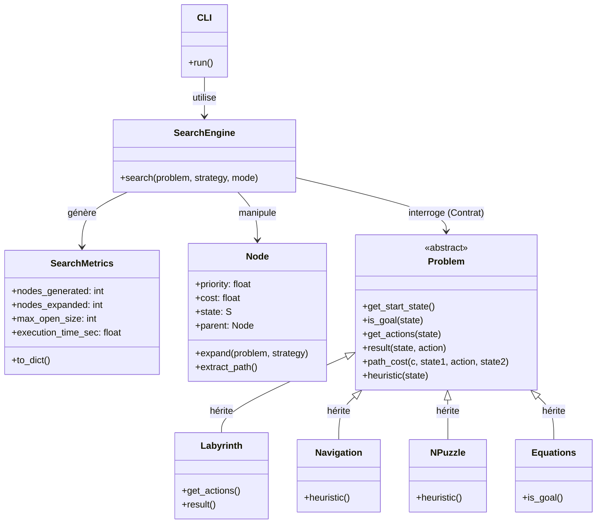

# AUSSI V2 - Agent Universel de Support Super Intelligent

Moteur générique de résolution de problèmes basé sur des algorithmes de recherche. Conçu pour traiter des domaines variés en conservant une logique d'exploration agnostique et modulaire.

## 🚀 Fonctionnalités principales
- **Moteur unifié :** Fonction `SEARCH(problem, strategy, mode)` supportant le *Tree-Search* et le *Graph-Search*.
- **Stratégies :** BFS, UCS, Greedy Search et A*.
- **Domaines de problèmes :**
  1. **Labyrinthes :** Chemins avec coûts uniformes ou variables et obstacles.
  2. **Navigation :** Mini Google Maps avec graphes de villes et heuristique de distance.
  3. **N-Puzzle :** Résolution par déplacement de tuiles avec protection mémoire.
  4. **Équations / Arithmétique :** Construction d'expressions à partir d'un ensemble de chiffres et d'opérateurs.
- **Métriques :** Suivi des nœuds générés, expansés, taille max de `OPEN` et temps CPU.

---

## 📂 Structure du Projet

```text
root/
│
├── src/
│   ├── __init__.py
│   │
│   ├── core/                    # Le Moteur Algorithmique
│   │   ├── __init__.py
│   │   ├── problem.py           # Classe abstraite Problem (Contrat)
│   │   ├── node.py              # Classe Node & logique de priorité
│   │   └── search_engine.py     # Moteur SEARCH(problem, strategy, mode) + Metrics
│   │
│   ├── problems/                # Les Domaines Métiers
│   │   ├── __init__.py
│   │   ├── labyrinth.py         # Implémentation Labyrinthes
│   │   ├── navigation.py        # Implémentation Mini Google Maps + Heuristique
│   │   ├── npuzzle.py           # Implémentation N-Puzzle (+ gestion mémoire)
│   │   └── equations.py         # Implémentation Jeu Arithmétique
│   │
│   └── ui_metrics/              # Interface & Observabilité
│       ├── __init__.py
│       ├── metrics.py           # Collecte et formatage des stats
│       └── cli.py               # Interface textuelle (choix problème/stratégie)
│
├── tests/                       # Tests unitaires (Moteur + Problèmes)
│   ├── test_search.py
│   └── test_problems.py
│
├── main.py                      # Point d'entrée principal de l'application
├── requirements.txt             # Dépendances (ex: pytest)
└── README.md                    # Documentation du projet
```
---

## 🗺️ Architecture & Classes



### ⚙️ Fonctionnement des classes
- **`SearchEngine` (Le Moteur) :** Pilote la boucle de recherche globale en manipulant les `Node` et en interrogeant le problème.
- **`Problem` (Le Contrat) :** Définit les règles du domaine (états, actions, transitions) sans se soucier des algorithmes de recherche.
- **`Node` (Le Transporteur) :** Encapsule un état, mémorise son parent, son coût et gère l'expansion via le contrat `Problem`.
- **`SearchMetrics` (Le Chrono) :** Enregistre les statistiques d'exécution en temps réel (nœuds, temps CPU).

## ⚙️ Démarrage rapide

1. **Installer les dépendances :**
   ```bash
   pip install -r requirements.txt